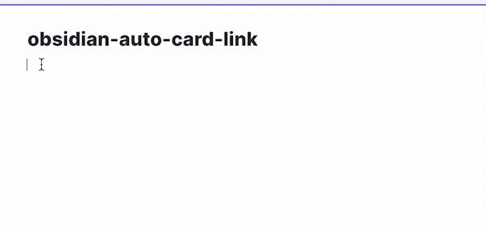

# 自动卡片链接

[English](README.md) | [中文](README.zh.md)

- 自动从URL获取元数据并将其制作为卡片式链接。
- 卡片式链接通过代码块生成，不会像HTML标签那样弄乱您的Markdown文件！

<p align="center">
    
</p>

# 功能
- 粘贴并增强复制的URL
- 增强选中的URL
- 设置默认粘贴增强
- 通过内部链接支持本地图片（`image: "[[image.png]]"`）


# `cardlink` 语法
代码块 `cardlink` 使用YAML语法来显示卡片式链接。


## 属性
|名称|必填|描述|
|---|---|---|
|url|是|点击链接时打开的URL|
|title|是|链接的标题|
|description|否|链接的描述|
|host|否|链接的主机|
|favicon|否|链接的网站图标|
|image|否|在卡片链接中显示的缩略图|


## 示例

​```cardlink
url: https://obsidian.md/
title: "Obsidian"
description: "Obsidian: 一个基于本地Markdown文件的知识库。"
host: obsidian.md
favicon: https://obsidian.md/favicon.ico
image: https://obsidian.md/images/banner.png
​```

# 自定义样式
卡片式链接由[styles.css](./styles.css)样式化。要自定义，您可以尝试制作[CSS片段](https://help.obsidian.md/How+to/Add+custom+styles#Use+Themes+and+or+CSS+snippets)。

# 动机
- 希望在笔记中展示美观的链接
- 不想用HTML标签弄乱笔记